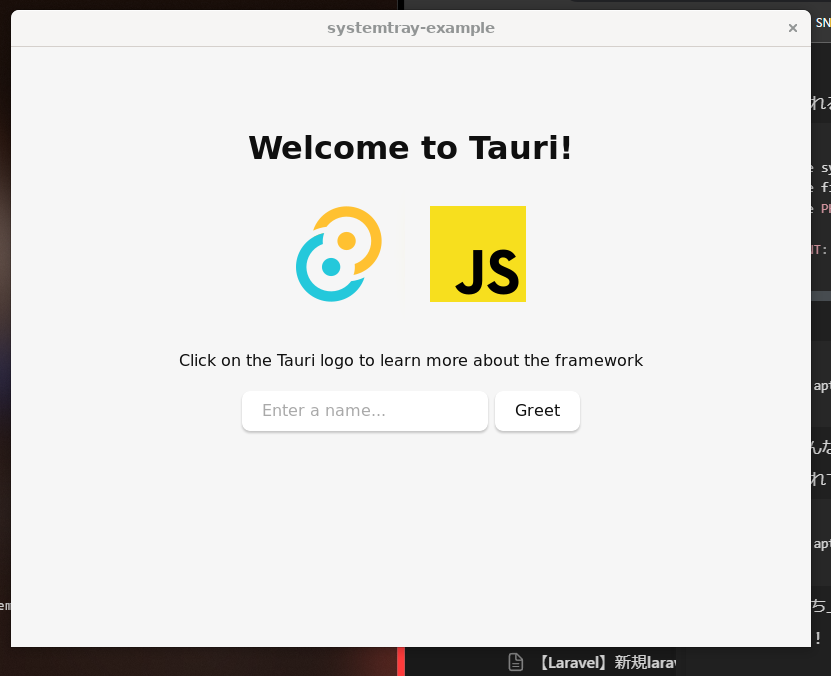

## 現状
- 前提として、WSL2上でRustが動く状態。Cargoとかも使える。

## やろうとしてること
- Tauri公式のクイックスタートを実行して立ち上がること。

書いてある通りにしてみる
```
cargo install create-tauri-app --locked
cargo create-tauri-app
```
ここまで実行すると、
- アプリ名をどうするか聞かれる。これがディレクトリ名になる。
- フロントエンドをどうするか聞かれる。とりあえずRustをえらんだような
- UIテンプレートをどうするか聞かれる。たしかvanillaをえらんだような
上３つを実行したら、tauri-cliがないと怒られるので入れる
```
cargo install tauri-cli
```
作成されたアプリのディレクトリに入る
```
cd systemtray-example
```
一旦そのまま立ち上げてみる
```
cargo tauti dev
```
なんやかんやコンパイルしたりして時間かかったけど最終的にエラーが出る。
```
The system library glib-2.0 required by crate glib-sys was not found.
The file glib-2.0.pc needs to be installed and the PKG_CONFIG_PATH environment variable must contain its parent directory.
The PKG_CONFIG_PATH environment variable is not set.
```
ググるとどうもそのまま glib-2.0をいれでもだめらしいので、libgtk-3-devをいれてみる。
```
sudo apt install libgtk-3-dev
```
再度立ち上げてみる。そしたらまた怒られる。
```
The system library `libsoup-2.4` required by crate `soup2-sys` was not found.
The file `libsoup-2.4.pc` needs to be installed and the PKG_CONFIG_PATH environment variable must contain its parent directory.
The PKG_CONFIG_PATH environment variable is not set.

HINT: if you have installed the library, try setting PKG_CONFIG_PATH to the directory containing `libsoup-2.4.pc`
```
なので、入れてみる
```
sudo apt install libsoup2.4-dev
```
再度、立ち上げてみる。また怒られた。
```
The system library `javascriptcoregtk-4.0` required by crate `javascriptcore-rs-sys` was not found.
The file `javascriptcoregtk-4.0.pc` needs to be installed and the PKG_CONFIG_PATH environment variable must contain its parent directory.
The PKG_CONFIG_PATH environment variable is not set.
HINT: if you have installed the library, try setting PKG_CONFIG_PATH to the directory containing `javascriptcoregtk-4.0.pc`.
```
なので、いれてみる。
```
sudo apt install javascriptcoregtk-4.0
```
すると、「そんなものはない」と怒られる。
ググってみて、以下を入れてみるといいかもしれないので入れてみる
```
sudo apt install libwebkit2gtk-4.0-dev
```
再度立ち上げてみる。
動いた！

